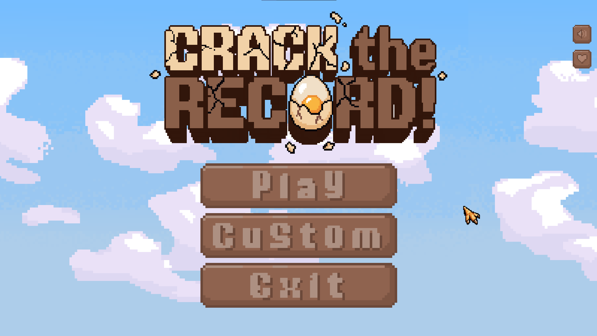
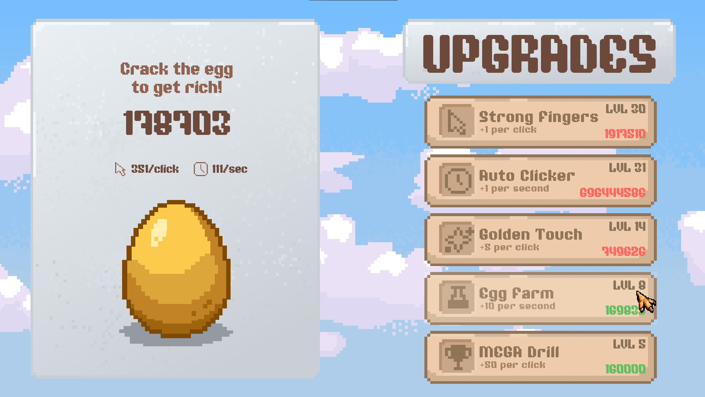
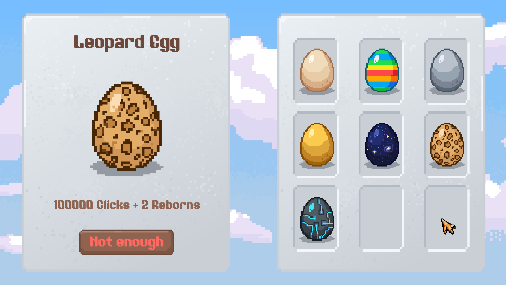

<p align="center">
  
</p>

[](https://www.python.org/)
[](https://www.pygame.org/)
[](LICENSE)
[]()

> **A clicker with soul** — tap the egg, unlock skins, upgrade your clicks, and rebirth for a multiplier. Pixel art style, smooth transitions, and a built‑in shop.

<video src="docs/gameplay.mp4" width="700" autoplay loop muted></video>
*🎬 This video demonstrates the gameplay. To watch with sound, open the file locally.*
## 📌 Table of Contents
- [Features](#-features)
- [Screenshots & Video](#-screenshots--video)
- [Installation & Run](#-installation--run)
- [Controls](#-controls)
- [Game Mechanics](#-game-mechanics)
- [License](#-license)

## ✨ Features

- **Core clicker** – tap the egg to earn points.
- **Upgrades** – 5 upgrades: click power, auto clicker, golden touch, egg farm, mega drill.
- **Rebirth system** – reset progress for a permanent multiplier (x2, x3, …).
- **Skin shop** – 7 unique eggs: from Classic to "Tech Egg" (purchased with clicks and reborns).
- **Atmosphere** – background music, click and purchase sounds, and a secret "kukareku" on the logo.
- **Auto-save** – all progress (points, upgrades, skins) is saved to `saves/game_data.json`.
- **Fullscreen mode** – adaptive UI for any resolution.

## 📸 Screenshots & Video

> **Gameplay video**

<video src="docs/gameplay2.mp4" width="700" autoplay loop muted></video>
*🎬 This video demonstrates the gameplay. To watch with sound, open the file locally.*

**Screenshots:**

| Menu | Gameplay | Shop |
|------|----------|-----------|
|  |  |  |

## 🔧 Installation & Run

### Requirements
- Python 3.13 or higher
- Pygame 2.6.1

### Instructions

```bash
# 1. Clone the repository
git clone https://github.com/SirKachan/CrackTheRecord-Game.git
cd CrackTheRecord-Game

# 2. (Recommended) Create a virtual environment
python -m venv venv
source venv/bin/activate   # Linux/macOS
venv\Scripts\activate      # Windows

# 3. Install dependencies
pip install pygame>=2.6.1

# 4. Run the game
python main.py
```

## 🎮 Controls

| Action | Key / Mouse |
|--------|-------------|
| Click the egg | Left mouse button on the egg (in game mode) |
| Buy upgrade | Left click on the upgrade button |
| Open shop | `CUSTOM` button in main menu |
| Rebirth | `REBORN` button (❤️) in main menu |
| Toggle music | `SOUND` button (🔊) in main menu |
| Exit game / Return to menu | `ESC` key (from game — to menu, from menu — exit) |

## 🧠 Game Mechanics

### 1. Points (Clicks)
- Earned by clicking the egg and from auto clickers.
- Spent on upgrades and skins.

### 2. Upgrades

| Name | Type | Effect | Base Price |
|------|------|--------|------------|
| Strong Fingers | click | +1 click power | 10 |
| Auto Clicker | auto | +1 click/sec | 50 |
| Golden Touch | click | +5 click power | 200 |
| Egg Farm | auto | +10 click/sec | 1000 |
| Mega Drill | click | +50 click power | 5000 |

Each upgrade becomes more expensive after purchase (growth factor from 1.5 to 2.0).

### 3. Rebirth
- **Cost:** `500,000 × (2.5 ^ rebirth count)` points.
- **Effect:** Resets all points and upgrades, but multiplies all income.
- Rebirth count is shown in the Reborn window.

### 4. Skins

| Skin | Click Cost | Rebirths Required |
|------|------------|-------------------|
| Classic Egg | 0 | 0 |
| Striped Egg | 500 | 0 |
| Silver Egg | 2500 | 0 |
| Gold Egg | 10000 | 0 |
| Cosmic Egg | 50000 | 1 |
| Leopard Egg | 100000 | 2 |
| Tech Egg | 250000 | 5 |

### 5. Custom Cursor
The game replaces the system cursor with a custom pixel-art cursor for a consistent visual style.

## 📄 License

This project is licensed under the **MIT License** — see the [LICENSE](LICENSE) file for details.

You are free to use, modify, and distribute this software, provided that the original copyright notice is included.